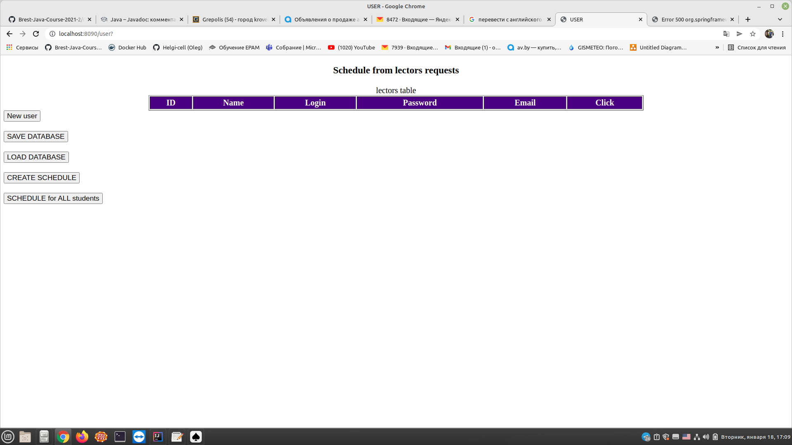
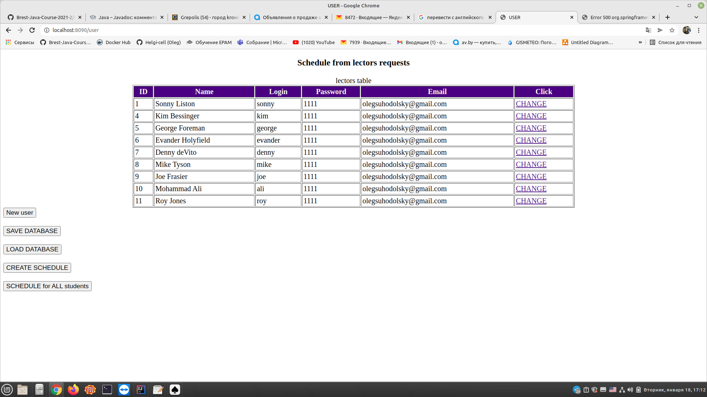
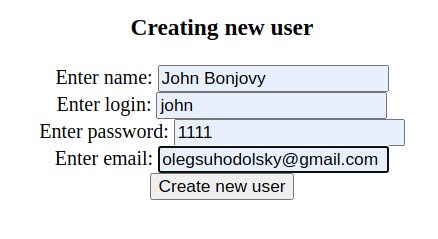
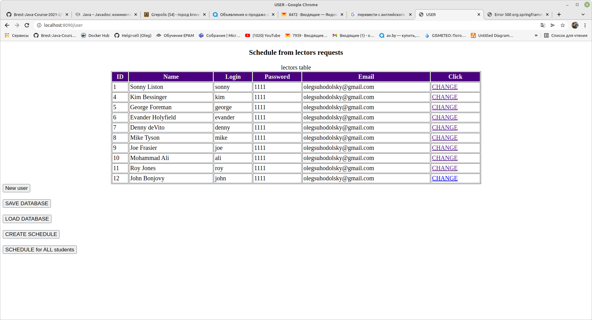
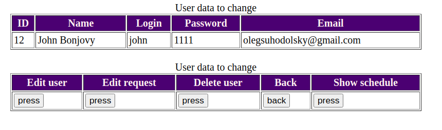
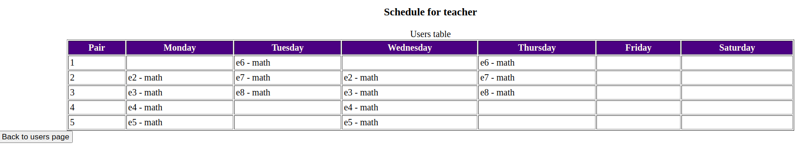
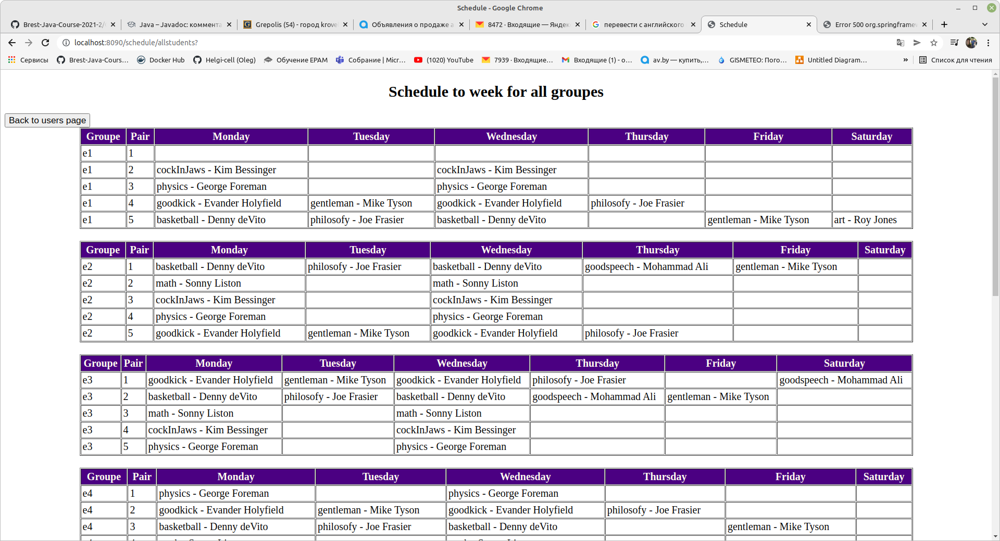

# *University schedule*  
***

### *_Brest-JavaCourse-2021-2_*  

### Автоматическое составление расписания занятий.

__Проект для автоматического составления расписания занятий.
Пользователи, зарегистрированные в системе (преподаватели)
делают заявки (указывают номер студенческой
группы, название предмета и количество занятий в неделю).
Накопив все заявки, система должна составить расписание.
Желательно, чтобы расписание было как можно более
качественным (отсутствие «дырок» у студентов и
преподавателей, равномерная загруженность).__

Приложение выполнено в виде монолитного многомодульного 
проекта Java.11, собранного на Maven 3.6.3.
Структура проекта показана на данной диаграмме:

REST приложение выполнено по трехслойной архитектуре : 
DAO-SERVICES-REST SERVICES. Слой DAO имплементирует соответствующий 
интерфейс DAO API, позволяющий полностью изменить источник данных,
способ общения с ним, не затрагивающий вышестоящие слои. Также, 
изменение реализации слоя SERVICES никак не повлияет на работу
слоя DAO. И это просто праздник какой-то........

Слой логики находится с слое DAO.
Основная концепция логики состоит в том, что данные из запросов 
преподавателей компонуются в сортированные по группам и преподавателям
блоки, которые затем пропускаются через определенные шаблоны, 
позволяющие исключить одновременную фиксацию запроса во времени и
обеcпечивающие сравнительную равномерность распределения запросов
для групп и преподавателей. Детали реализации беру на себя смелость
опустить, так как их описание будет слишком громоздким и никому не
нужным.

Основные инструменты, использованные в данном приложении:
1. База данных Н2, автоматически подымаемая с помощью плагина Мавен,
на сервере JETTY.
2. Файловое хранилище для хранения данных, которые можно подгрузить
в базу данных после деплоя REST приложения на сервер.
3. JDBC TEMPLATE для обмена данными с базой данных.
4. SPRING библиотеки для создания контекста приложения,
конфигурации контейнеров.
5. JACKSON библиотека для маппинга объектов в JSON объекты и отдачи
их контроллерами REST по запросам извне.
6. Thymeleaf для веб-приложения.
7. Тесты JUnit, Mock

### Installation info:

$ git clone https://github.com/Brest-Java-Course-2021-2/OlegSuhodolsky_UniversitySchedule.git

$ cd OlegSuhodolsky_UniversitySchedule

$ mvn clean install

### Run info:
###### (for REST SERVICE)

$ mvn -pl rest/ jetty:run

###### __(port : localhost:8099)__

### Next terminal:
###### (for WEB application)
###### $ cd OlegSuhodolsky_UniversitySchedule

$ mvn -pl web-app/ jetty:run

###### __(port : localhost:8090)__

in browser :  **http://localhost:8090/user**

## Application templates
##### ___This app can to create schedule in runtime when we are___
##### ___changing data in the database.___

In the beginning we get empty database.  See below

When we click __"LOAD DATABASE"__ button application fills
db tables from the saved files. See below:

This page we have several functional buttons:
- __New user__ - add new lector to the database.
- __SAVE DATABASE__ - save current data in the database 
  to the files. It's really recommended to do each correct changes.
- __LOAD DATABASE__ - load data from the files to the database.
  This operation doing once at a session. 
- __CREATE SCHEDULE__ - create schedules for students and lectors
  from the current database.
- __SCHEDULE for ALL students__ - It's show schedule for all students
  spelling by groupes.
- link "CHANGE" guide us to lectors functional menu.

When we click "New user" we can add new lector to the system.

See result below:

When we click "CHAGE" we'll get lectors page

Here we can edit lectors properties, requests and delete
lector from the database. "Show schedule" button 
provide schedule for lector personally

Below see the schedule page for all students:

